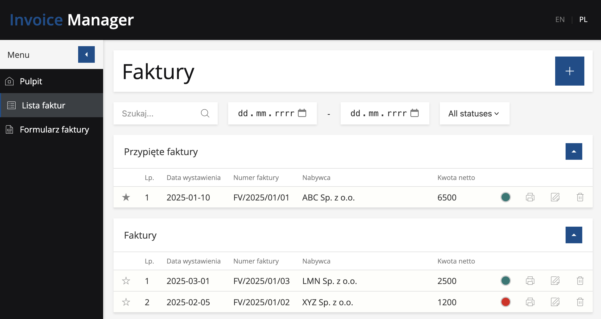
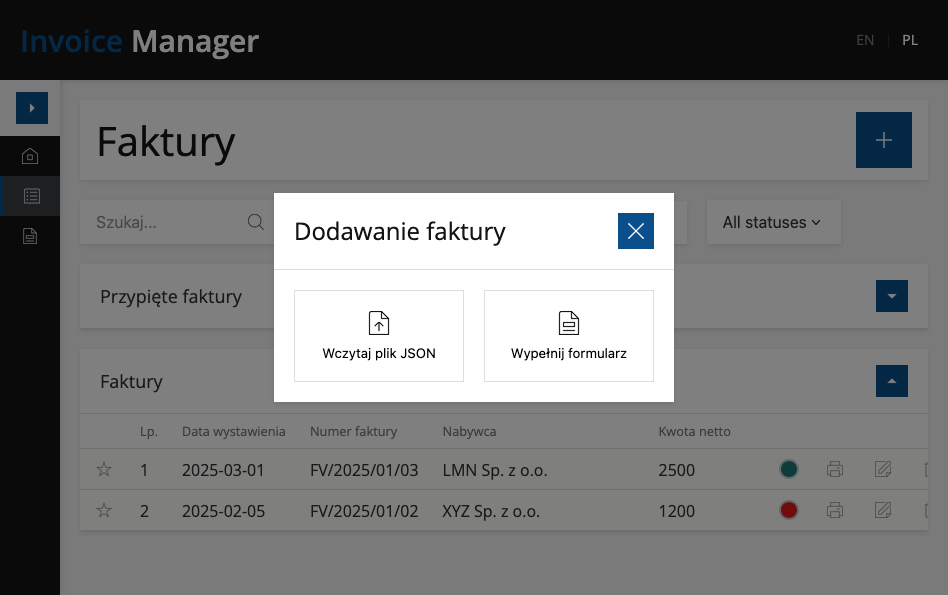
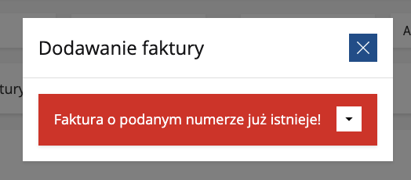
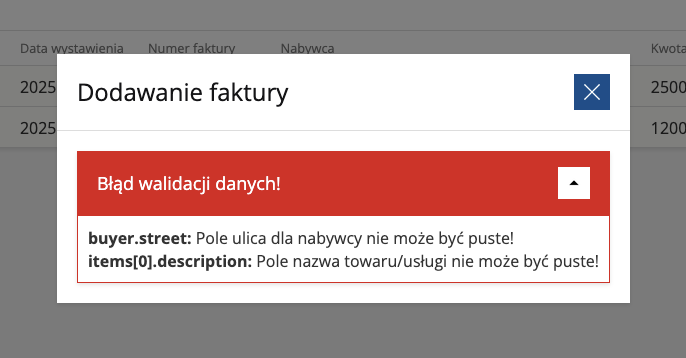
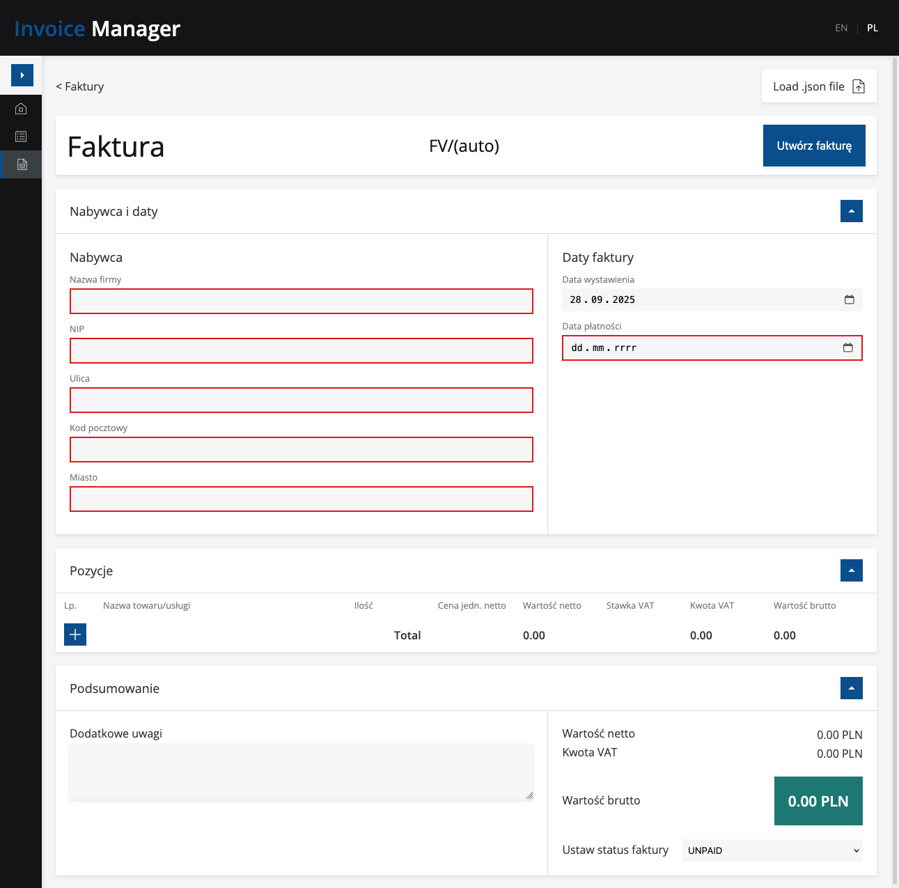
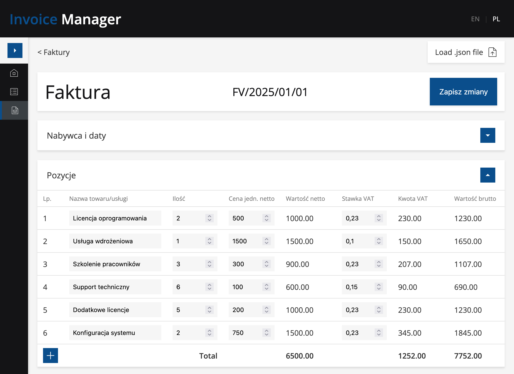
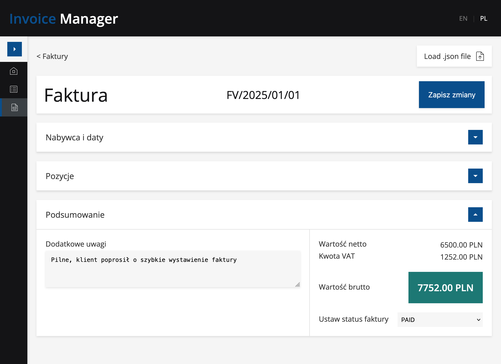
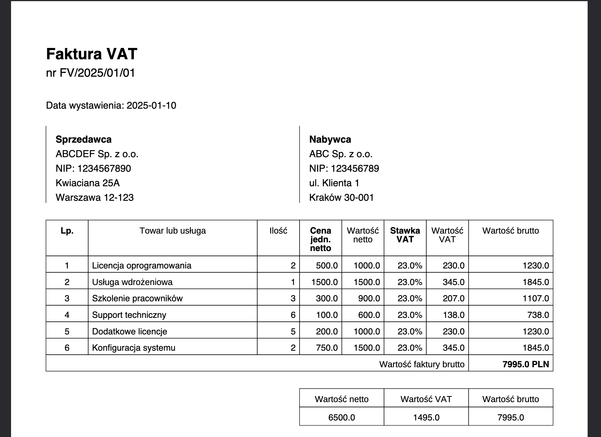

# Invoice Manager

## 📝 Zadanie rekrutacyjne

> **Firma wystawia faktury swoim klientom. Twoim zadaniem jest napisanie prostej aplikacji webowej (Java + Spring Boot + React), która umożliwi:**
>
> - Dodanie faktury
> - Wyświetlenie szczegółów faktury w UI w formie czytelnego podglądu
>
> **Wymagania:**
>
> - Widok na Frontendzie powinien prezentować fakturę w przejrzystej formie
> - Aplikacja przyjmuje dane wejściowe w postaci JSON
> - Na fakturze powinna być wyliczona kwota brutto, na podstawie przekazanej w json kwoty netto. Dla uproszczenia możemy przyjąć, że vat jest zawsze 23%. Na końcu powinna być również wyliczona suma końcowa.
> - W swojej implementacji dane przykładowe możesz trzymać w pamięci np. na liście
> - Nie zapomnij o testach

### ✅ **Status realizacji: UKOŃCZONE**

## 👨‍💻 Autor

**Wojciech Stochmal**

## 📸 Screenshots

### Lista faktur



### Dodawanie nowej faktury



### Błąd: faktura o takim numerze istnieje



### Błąd: podany plik JSON nieprawidłowy



### Formularz dodawania nowej faktury



### Przegląd istniejącej faktury



### Przegląd istniejącej faktury (podsumowanie)



### Wydruk uproszczonej drukowanej faktury pdf



## ✨ Funkcjonalności

- **Dodawanie faktury** - dodanie faktury poprzez plik json albo dostępny formularz
- **Edycja faktur** - modyfikacja istniejących farkur
- **Usuwanie faktur** - zarządzanie listą faktur
- **Generowanie PDF** - eksport do pliku PDF
- **Filtrowanie i wyszukiwanie** - filtr
- **Ulubione faktury** - oznaczanie ważnych pozycji
- **Wielojęzyczność** - PL/EN
- **Wyświetlanie szczegółow** - czytelny podgląd faktury
- **Autogenerowanie numeru faktury** - funckja dostępna tylko dla formularza
- **Dynamiczne przeliczanie wartości faktury** - przeliczanie wszytskich wartości dynamicznie (VAT można ustawić)

## 🛠️ **Implementacja**

### ✅ **Zgodność z wymaganiami zadania**

**Dane w pamięci (ArrayList):**

```java
@Repository
public class InvoiceRepository {
    private final List<Invoice> invoices = new ArrayList<>(); // Bez bazy danych!

    @PostConstruct
    public void loadSampleData() {
        // Ładowanie przykładowych danych z invoices.json do pamięci
    }
}
```

**VAT - automatyczne obliczenia:**

```java
public class InvoiceCalculator {
    public static void calculateTotalPrices(Invoice invoice) {
        for (var item : invoice.getItems()) {
            double itemNetAmount = item.getUnitNetPrice() * item.getQuantity();
            double itemVatAmount = itemNetAmount * item.getVatRate(); // 0.23 dla 23%
            double itemGrossAmount = itemNetAmount + itemVatAmount;

            // Ustawienie obliczonych wartości
            item.setNetPrice(itemNetAmount);
            item.setVatPrice(itemVatAmount);
            item.setGrossPrice(itemGrossAmount);
        }
        // Obliczenie sum końcowych faktury...
    }
}
```

### 🌐 **Internacjonalizacja**

```typescript
const TRANSLATIONS = {
  PL: { INVOICE_TITLE: "Faktura", VAT_RATE: "Stawka VAT" },
  EN: { INVOICE_TITLE: "Invoice", VAT_RATE: "VAT Rate" },
};
```

## 🛠️ Stack Technologiczny

### Backend

- **Java 21**
- **Spring Boot 3.5.6**
- **Maven**
- **Jackson**
- **Spring Validation**
- **iText PDF**

### Frontend

- **React 19.1.1**
- **TypeScript 5.8.3**
- **Vite 7.1.7**
- **Axios 1.12.2**
- **React Router Dom 7.9.1**
- **CSS Modules**

## 🚀 Instalacja i uruchomienie

### 1. Klonowanie repozytorium

```bash
git clone https://github.com/WStochmal/Invoice-Manager.git
cd Invoice-Manager
```

### 2. Uruchomienie backendu (Spring Boot)

```bash
# Przejście do folderu server
cd server

# Opcja 1: Używając Maven (jeśli zainstalowany)
mvn spring-boot:run

# Opcja 2: Używając Maven Wrapper (zalecane)
./mvnw spring-boot:run        # Linux/macOS
mvnw.cmd spring-boot:run      # Windows
```

Backend będzie dostępny pod adresem: `http://localhost:8080`

### 3. Uruchomienie frontendu (React)

```bash
# Otwórz nowy terminal i przejdź do folderu client
cd client

# Instalacja zależności
npm install

# Uruchomienie dev servera
npm run dev
```

Frontend będzie dostępny pod adresem: `http://localhost:5173`

## 📁 Struktura projektu

```
Invoice-Manager/
├── server/                    @Backend Spring Boot
│   ├── src/main/java/
│   │   ├── config/            # Data Loader
│   │   ├── controller/        # REST Controllers
│   │   ├── service/           # Business Logic
│   │   ├── repository/        # Data Access Layer
│   │   ├── model/             # Entity Classes
│   │   ├── dto/               # Data Transfer Objects
│   │   ├── util/              # Utility Classes
│   │   └── exception/         # Custom Exceptions
│   ├── src/main/resources/
│   │   └── invoices.json      # Sample data
│   └── src/test/              # Unit & Integration Tests
├── client/                    @ Frontend React
│   ├── src/
│   │   ├── api/               # API calls
│   │   ├── assets/            # Assets (icons)
│   │   ├── components/        # Components
│   │   ├── context/           # React Context
│   │   ├── hooks/             # Custom hooks
│   │   ├── layout/            # Application Layout Component
│   │   ├── localization/      # text localizaction
│   │   ├── pages/             # Application Pages
│   │   ├── reducers/          # Custom reducer for invoice in form
│   │   └── styles/            # Shared styles
│   │   └── tests/             # Unit Tests
│   │   └── types/             # Types
│   │   └── utils/             # Utils funtions
│   └── public/                # Static Assets
└── images/                    # Screenshots
```

## 🔧 Konfiguracja

### Backend

- **Port**: 8080 (konfigurowalny w `application.properties`)
- **CORS**: Skonfigurowany dla `http://localhost:5173`
- **Profile**: `dev` (domyślny)

### Frontend

- **Port**: 5173 (konfigurowalny w `vite.config.ts`)
- **API Base URL**: `http://localhost:8080/api`
- **Build Output**: `dist/`

## 📊 API Endpoints

### Faktury

- `GET /api/invoices` - Lista faktur (z opcjonalnym filtrowaniem)
- `GET /api/invoices/{id}` - Szczegóły faktury
- `POST /api/invoices/create` - Utworzenie faktury
- `PUT /api/invoices/update/{id}` - Aktualizacja faktury
- `DELETE /api/invoices/delete/{id}` - Usunięcie faktury
- `PATCH /api/invoices/{id}/toggle-favorite` - Toggle ulubiona
- `GET /api/invoices/{id}/download` - Pobieranie PDF

### Przykładowy request body (POST /api/invoices/create):

```json
{
  "invoiceNumber": "FV/2025/10/10",
  "issueDate": "2025-01-10",
  "dueDate": "2025-01-25",
  "buyer": {
    "name": "Comayo Sp. z o.o.",
    "NIP": "1234567890",
    "street": "ul. Warszawska 1",
    "city": "Kraków",
    "postalCode": "30-001"
  },
  "items": [
    {
      "description": "Licencja oprogramowania",
      "quantity": 2,
      "unitNetPrice": 500,
      "vatRate": 0.23
    },
    {
      "description": "Usługa wdrożeniowa",
      "quantity": 1,
      "unitNetPrice": 1500,
      "vatRate": 0.1
    }
  ]
}
```

## 📝 Podsumowanie realizacji zadania rekrutacyjnego

### ✅ **Wszystkie wymagania spełnione w 100%:**

Realizując zadanie w wyznaczonym czasie, udało się stworzyć funkcjonalną aplikację spełniającą wymagania wraz z dodatkowymi funkcjonalnościami. Naturalnym kierunkiem rozwoju byłoby dodanie autentykacji, bazy danych i oraz paginacji dla listy faktur.
